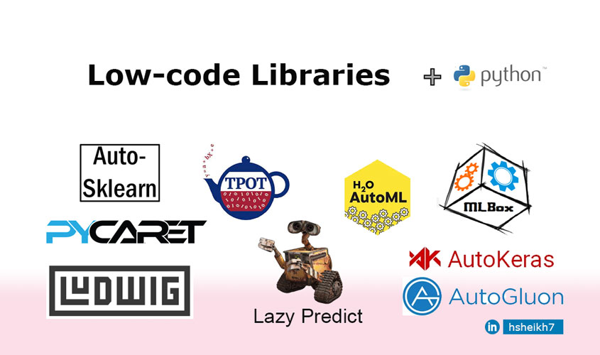

# Low-Code-Tools
Find the uses of low-code tools with examples. 

In Python, there are libraries that enable us to use pre-built components for different functionalities. They are Low-code and AutoML libraries.

Low-code and Automated Machine Learning (AutoML) libraries share a common thread of simplifying complex tasks. While AutoML automates the process of model selection and hyperparameter tuning, low-code libraries abstract intricate coding tasks.

Interested in learning more about differences, check this article out: https://lnkd.in/ehM52qvH

Both types of libraries are great tools for bridging the gap between technical complexity and accessibility. In this way, we focus on the main logic and arguments.

In this folder, I show the use of low-code tools with sample projects.  
